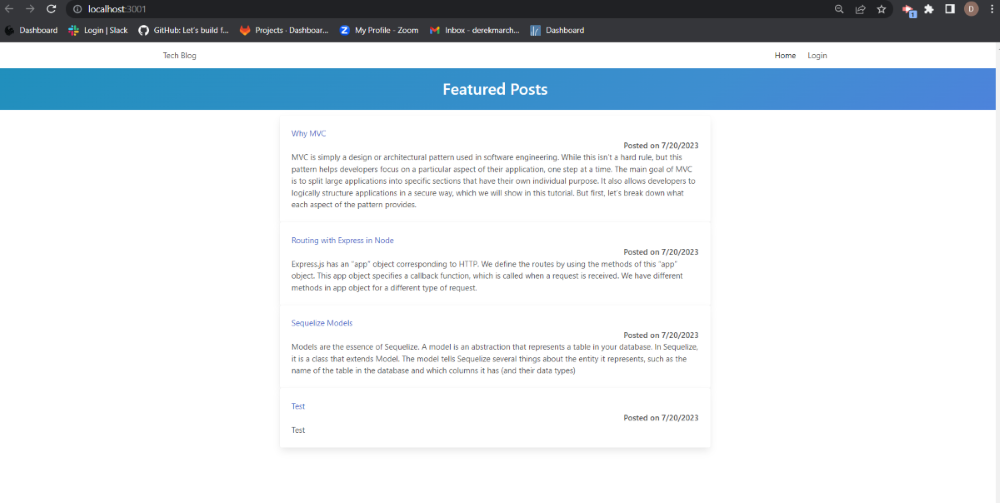

# Tech Blog Site

## Description
This project is similar to a wordpress site, where developers in the tech industry can publish their blog posts. Also, developers can comment on other posts on the web page. This app follows the MVC (model-view-controller) that uses technologies like handlebars, node js, mysql, sequelize and other npm packages. The deployed app is on Heroku.

## Table of Contents
  * [Installation](#installation)
  * [Usage](#usage)
  * [License](#license)
  * [Contribute](#contributions)
  * [Tests](#tests)
  * [Questions?](#questions)

## Installation
No installation needed. Check out the live site <a href="">HERE</a>.

## Usage
Feel free to create a username and password to contribute to my blog!

## License

## Contribute
Please feel free to contact me on my email or my github to contribute.

## Tests
No tests available at this time.

## Questions
Please reach out to me at derekmarchese1@gmail.com. 
Or check out my <a href="https://github.com/dtm589">GitHub</a>.